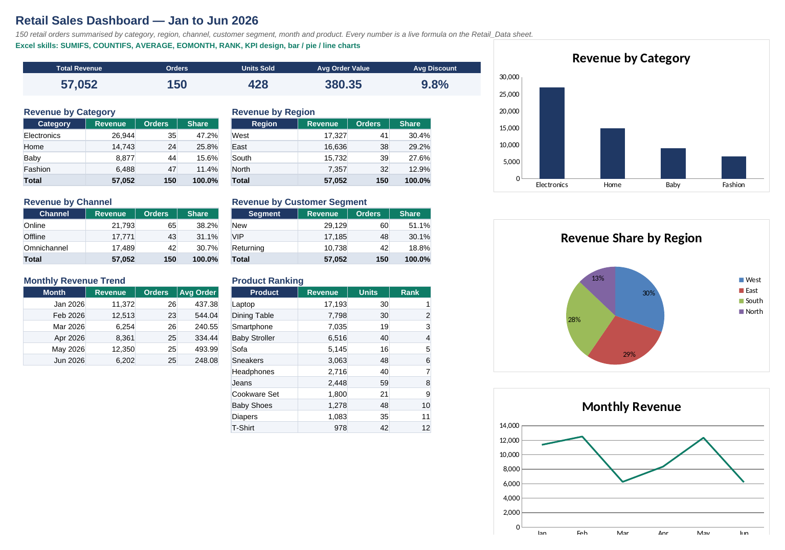

# Retail Sales Analytics – Excel Portfolio

An Excel project that turns raw retail data into a KPI dashboard, plus the formula work behind it: business-rule flags, customer segmentation, conditional totals, text cleaning and visual exception reporting.

Built during the **Business Analytics with AI** programme (Frontlines EduTech, live online, 2026).



## What the workbook covers

| Sheet | What it shows | Excel skills |
|---|---|---|
| **Overview** | Project summary, sheet index, key findings | Hyperlinks, documentation |
| **Dashboard** | 5 KPIs, 6 summary tables and 4 charts on 150 orders (Jan–Jun 2026) | SUMIFS, COUNTIFS, AVERAGE, EOMONTH, RANK, bar / pie / line charts |
| **Retail_Data** | Clean source table with a calculated Revenue column | Excel Tables, filters, formulas |
| **Cell_References** | GST calculator, target tracker and monthly tax grid | Relative, absolute and mixed references |
| **IF_Logic** | 20 business-rule columns on sales invoices (VIP, fraud check, tax, data validation) | IF, AND, OR |
| **Nested_IF** | 20 multi-level rules that grade customers and choose the next sales action | Nested IF (up to 4 levels), AND / OR |
| **SUMIF_COUNTIF** | 29 manager questions with live answers | SUMIF, COUNTIF, SUMIFS, COUNTIFS |
| **Text_Functions** | Cleaning a messy customer list (spaces, capitals, emails, IDs) | TRIM, PROPER, LEFT/RIGHT/MID, FIND, SEARCH, SUBSTITUTE, TEXTJOIN |
| **Conditional_Formatting** | 35 orders with 8 visual rules, plus a customer growth table | Highlight rules, formula rules, data bars, icon sets |

Everything is calculated with formulas, so if you change the data, every result updates. Each module sheet ends with a table showing the business rule and the exact formula used.

## Key findings

- **Electronics** is the largest category at **47%** of revenue. That's more than Fashion and Baby combined.
- **North** is the weakest region (**13%** of revenue), less than half of West (30%).
- Revenue peaked in **February** and was lowest in **June**. The half-year was uneven, not steadily growing.
- The top two products (**Laptop** and **Dining Table**) bring in **44%** of all revenue.

## How to use

1. Download `Retail_Sales_Excel_Analytics_Portfolio.xlsx` and open it in Microsoft Excel (2019 or 365 recommended).
2. Start on the **Overview** sheet and click any sheet name to jump to it.
3. Try changing a value. For example, change the GST rate on *Cell_References* or a sales amount on *IF_Logic* and watch the results update.

## Repository structure

```
├── Retail_Sales_Excel_Analytics_Portfolio.xlsx
├── README.md
└── images/
    └── dashboard.png
```

## Next steps

- Rebuild the dashboard in Power BI
- Answer the same business questions with SQL

---
**Saideepak Ramarangula** · Berlin · [LinkedIn](#) · [Email](#)
